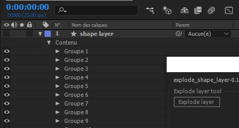

# [After Effects Script] Explode Shape layer

__Explode Shape Layer__ is an After Effects Script that allow you to extract shapes from a _shape layer_ to individual layers.

### Warning
The script still in a __development stage.__ It is __unstable !__

## How to use it ?

The usageis very simple:
- Select the layer to explode (shape layer only)
- Click the button
- Tadaaa !

## How do I install it ?

Copy the `.jsxbin` or `.jsx` file into your After Effets' _ScriptUI Panels_ folder:
- Windows: `Program Files\Adobe\Adobe After Effects <version>\Support Files\Scripts\ScriptUI Panels\`
- Mac OS: `Applications/Adobe After Effects <version>\Scripts\ScriptUI Panels\`

Then, activate the script in AE menu : `window -> explode_shape_layer`

#### Alternative

You can directly launch the script using AE menu: `File -> Scripts -> Run Script File`

## Compatibility
Works on :
- After Effects __CC 2017__
- Not tested on previous versions
